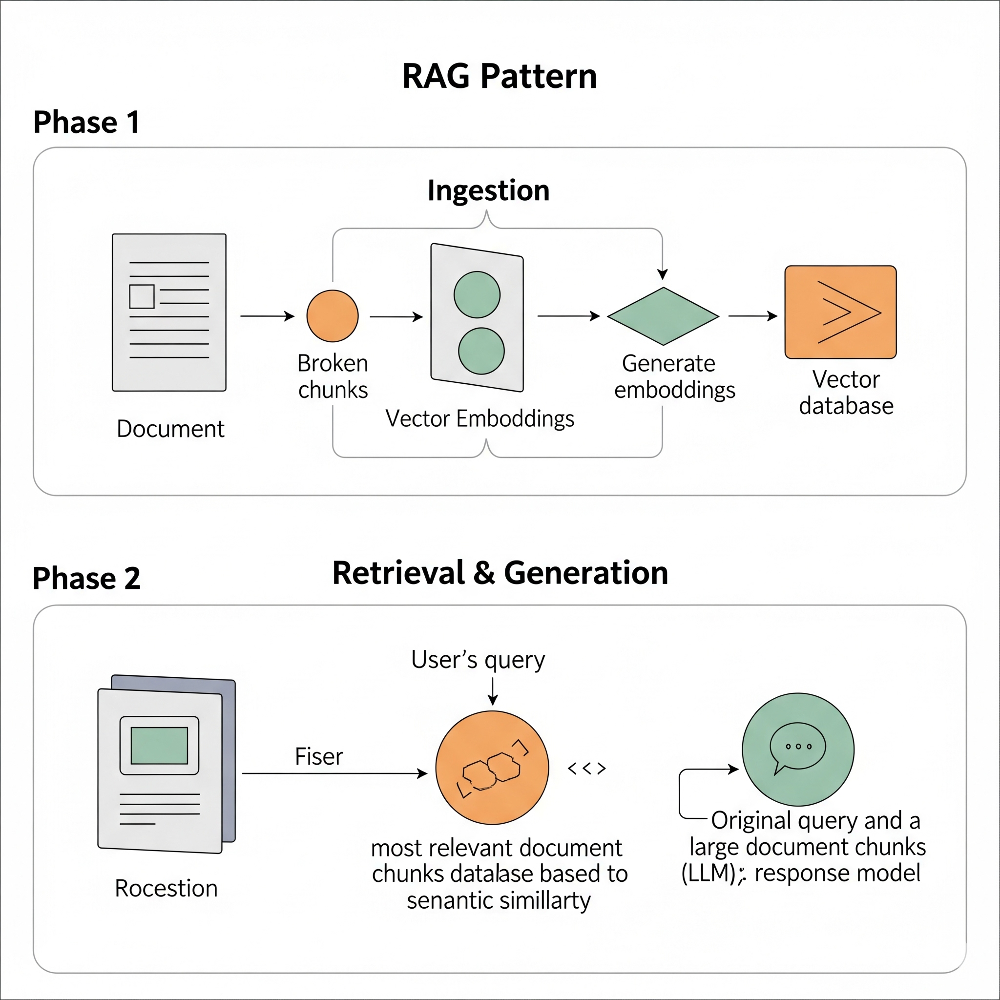

# Module 8 : Construire sa Base de Connaissances Vectorielle

Nous avons compris la théorie du RAG. Il est maintenant temps de mettre en œuvre sa première phase, la plus cruciale : l'**ingestion de données**. L'objectif est de transformer un document standard (comme un PDF), que les machines ne peuvent pas "comprendre" nativement, en une base de données structurée et optimisée pour la recherche sémantique : une **base de données vectorielle**.

Dans ce module, nous allons prendre un document PDF, le découper, le "vectoriser", et stocker le tout dans **ChromaDB**.

---

## 1. Les Prérequis Techniques

Pour ce module, nous avons besoin de nouvelles librairies spécialisées.

* **Nouvelles Librairies Python :**
    * `chromadb` : La base de données vectorielle qui stockera nos documents. Très simple à utiliser en local.
    * `pypdf` : Une librairie efficace pour lire et extraire le texte des fichiers PDF.
    
    Installez-les avec `pip` (assurez-vous que votre environnement virtuel est activé) :
    ```bash
    pip install chromadb pypdf
    ```

* **Nouveau Modèle d'Embedding Ollama :**
    Le cœur de notre base de données sera la qualité des "embeddings". Pour cela, nous utiliserons un modèle spécialisé.
    
    Téléchargez-le avec Ollama :
    ```bash
    ollama pull mxbai-embed-large
    ```
    Ce modèle est optimisé pour transformer du texte en vecteurs numériques de haute qualité, ce qui est essentiel pour une recherche pertinente.

---

## 2. Le Plan d'Ingestion, Étape par Étape

Le script que nous allons créer suit un cheminement logique et industriel pour traiter n'importe quel document.



1.  **Charger le Document** : On ouvre le fichier PDF et on en extrait tout le contenu textuel brut.
2.  **Découper le Texte (Chunking)** : Un document entier est trop long pour être analysé. On le segmente en plus petits morceaux ("chunks") qui se chevauchent légèrement pour ne pas perdre le contexte entre les morceaux.
3.  **Créer un Client ChromaDB** : On se connecte à notre base de données vectorielle. ChromaDB peut fonctionner en local sans serveur dédié, ce qui est parfait pour nos besoins.
4.  **Stocker les Chunks** : Pour chaque morceau de texte, ChromaDB va automatiquement utiliser le modèle d'embedding (`mxbai-embed-large`) pour le transformer en un vecteur. Ce vecteur, le texte original et des métadonnées sont ensuite stockés dans la base.

---

## 3. Le Choix Crucial : Le Modèle d'Embedding

Pour un système RAG, le choix du modèle qui crée les vecteurs est plus important que le choix du LLM qui génère la réponse finale. Une mauvaise recherche conduit inévitablement à une mauvaise réponse.

| Type de Modèle | Avantages | Inconvénients | Idéal Pour... |
| :--- | :--- | :--- | :--- |
| **Spécialisé (ex: `mxbai-embed-large`)** | ✅ **Haute Qualité :** Vecteurs très précis, capturent finement le sens. <br> ✅ **Rapidité & Efficacité :** Optimisés pour cette unique tâche. | ❌ Ne peut pas générer de texte (chatter). | **RAG, Recherche, Classification.** C'est le choix recommandé. |
| **Généraliste (ex: `llama3`)** | ✅ Un seul modèle pour tout faire (chatter et créer des embeddings). | ❌ **Qualité Inférieure :** Les vecteurs sont moins précis, la recherche est moins pertinente. <br> ❌ **Lenteur & Coût :** Utiliser un gros LLM pour cette tâche est inefficace. | Des expérimentations simples, mais **non recommandé pour un RAG performant**. |

> **Recommandation :** Pour un système RAG de qualité, utilisez **toujours** un modèle d'embedding spécialisé. La pertinence de votre application en dépend directement.

---

## 4. L'Art du Découpage (Chunking) et des Métadonnées

* **Stratégies de Chunking :**
    * **Taille Fixe (avec chevauchement) :** La méthode la plus simple. On coupe le texte tous les `X` caractères, avec une petite superposition pour garder le contexte. C'est un excellent point de départ.
    * **Basé sur la Structure :** On peut couper en suivant les paragraphes, les titres, les listes... C'est plus logique sémantiquement si le document est bien structuré.
    * **Sémantique :** Des techniques avancées utilisent un modèle pour détecter les changements de sujet et couper à ces endroits.

* **Pourquoi les Métadonnées sont importantes ?**
    En plus du texte, on peut associer à chaque chunk des informations supplémentaires : le nom du fichier, le numéro de page, une date, etc.
    Cela permet plus tard de **filtrer la recherche** (ex: "cherche uniquement dans les documents de 2023") ou de donner plus de contexte au LLM pour sa réponse.

---


**[➡️ Prochain Module : Interroger sa Base de Connaissances](./09_interrogation_rag.md)**